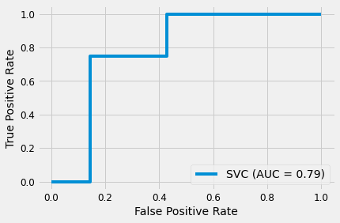
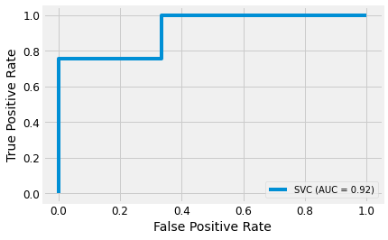

# Modelos como complemento para la ayuda a la detección de la enfermedad de Parkinson por analisis de voz e imagenes

![]

Este proyecto tuvo como finalidad el analizar dos datasets relacionados con la enfermedad de Parkinson y aplicar modelos de machine learning con el objetivo de estimar si el sujeto de prueba esta saludable o por el contrario si presenta la enfermedad. 

En "Parkinson_drawings" se hizo extrajo la data de fotografiás de espirales dibujadas por personas con parkinson y personas sin la enfermedad. 

Luego se aplico el modelo de Support Vector Machine (SVM) para analizar y reconocer patrones sutiles entre los dos casos. Sin embargo el modelo no obtuvo un buen desempeño, ya que solo puede detectar la enfermedad con un 72%

Lo cual pudo ser ocasionado por lo reducido de la data. 

En el caso de el notebook "Parkinson_tuning" se utilizo un dataset que está compuesto por una serie de medidas biomédicas de la voz de 31 personas, 23 de ellas con la enfermedad de Parkinson (EP). Cada columna de la tabla es una medida de voz concreta, y cada fila corresponde a una de las 195 grabaciones de voz de estas personas.

## Tabla de Microlensing

| Name  | Description |
| ------------- | ------------- |
| name	  | ASCII subject name and recording number |
| MDVP:Fo(Hz)	  | Average vocal fundamental frequency |
| MDVP:Fhi(Hz) | Maximum vocal fundamental frequency |
| MDVP:Flo(Hz)	 | Minimum vocal fundamental frequency |
| MDVP:Jitter(%), MDVP:Jitter(Abs), MDVP:RAP, MDVP:PPQ, Jitter:DDP | Several measures of variation in fundamental frequency |
| MDVP:Shimmer, MDVP:Shimmer(dB), Shimmer:APQ3, Shimmer:APQ5, MDVP:APQ, Shimmer:DDA  |Several measures of variation in amplitude |
|NHR, HNR | Two measures of the ratio of noise to tonal components in the voice |
| status | The health status of the subject (one) - Parkinson's, (zero) - healthy |
| RPDE, D2 | Two nonlinear dynamical complexity measures  |
| DFA  | Signal fractal scaling exponent
| spread1, spread2, PPE  |Three nonlinear measures of fundamental frequency variation |

El modelo utilizado fue Support Vector Machine con el que se puede detectar la enfermedad con un 92%. Sin embargo, tiene un mejor rendimiento para clasificar los enfermos que aquellos que estan saludables, ya que se obtuvo un precission de 80%, un recall de 67% y un F1 score de 73%.

Esto puede deberse a que la data no está balanceada.

Para esta segunda data también se intentaron con otros modelos pero que el que tuve un mejor rendimiento fue SVM como se puede ver en las siguentes curvas ROC. 

